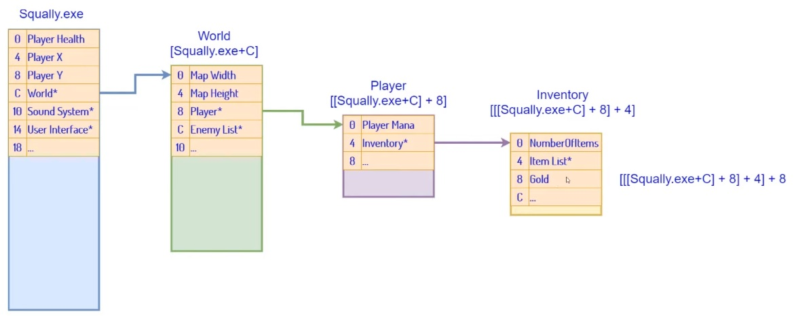
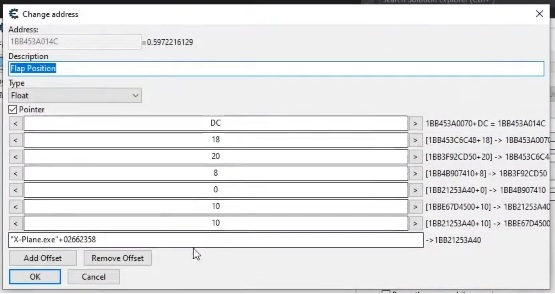

# MLP-Library

## Example multilevel pointer

 

## Explanation multilevel pointers

[Explanation by @GuidedHacking](https://youtu.be/_W0xdVO8-j4)

  
## Example of use with Cheat Engine (outdated)


1. For example, we have the following offsets:
- ( [ **X-Plane.exe** + **02662358** ] + **10** + **10** + **0** + **8** + **20** + **18** + **DC** ) -> dynamic address 

 
<br/>


2.  First will internally fetch and load the program's base address.

``` cpp
getWindowsInfo64("X-Plane.exe", "X-System");
```
Explanation:

**"X-Plane.exe"**: Represents the .exe of the target program (It could also be a dll or not at all, this depends on how the program is made.)

**"X-System"**: It is the name of the process (It is the same name as the process opened by Cheat Engine)
<br/><br/>
3. Set the compensation matrix. (must be in hexadecimal)
``` cpp
unsigned int flap_offsets = [0x02662358, 0x10, 0x10, 0x0, 0x8, 0x20, 0x18, 0xDC];
```

4.  Create the object that will manage the "connection" with the program var
``` cpp
    Addy64 myFlaps(flap_offsets);
```

5. Now can get and write data directly to the program variable, 
``` cpp
    std::cout << myFlaps.getFloat() << std::cout; // Get data

    myFlaps.setFloat(77.3) // Write data
```
